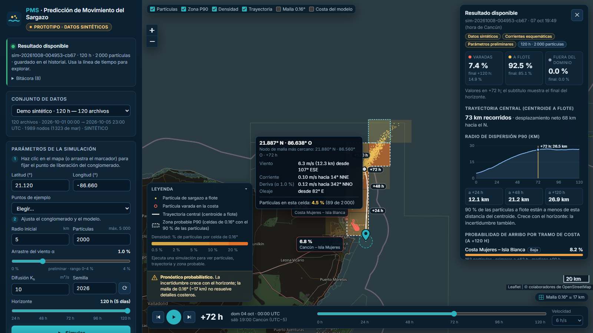
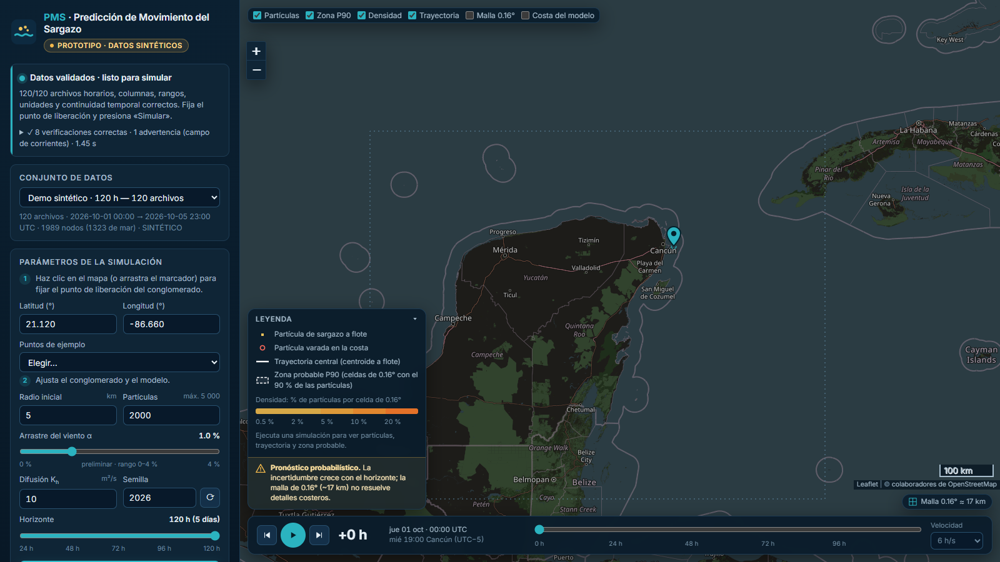
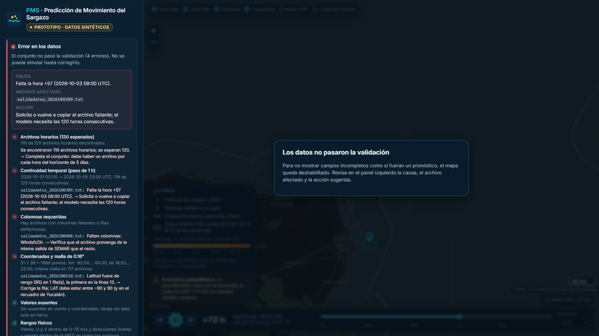

# PMS · Predicción de Movimiento del Sargazo — prototipo visual

**Demo en línea:** <https://pms-sargazo.vercel.app>

> **Prototipo con datos sintéticos.** Muestra cómo se verá y se sentirá la aplicación
> terminada, de punta a punta, para revisarla con el equipo y con SEMAR. Los campos de
> viento y corriente **no son datos reales** y los parámetros del modelo **no están
> calibrados**: nada de lo que muestra sirve para tomar decisiones.



*Simulación de 120 h desde frente a Cancún, pausada en +72 h: partículas a flote (ámbar) y
varadas (anillos coral), trayectoria central, densidad y zona probable P90 en celdas de
0.16°, tooltip con los valores del nodo de malla
más cercano y resumen probabilístico del resultado.*

---

## Contenido

1. [Problema y contexto](#problema-y-contexto)
2. [Qué es y qué no es este prototipo](#qué-es-y-qué-no-es-este-prototipo)
3. [Cómo correrlo en Windows](#cómo-correrlo-en-windows-powershell) · [Despliegue en Vercel](#despliegue-en-vercel)
4. [Qué se ve en la pantalla](#qué-se-ve-en-la-pantalla)
5. [El modelo](#el-modelo)
6. [Datos y validación](#datos-y-validación)
7. [API](#api)
8. [Mapa del repositorio](#mapa-del-repositorio)
9. [Pruebas y evidencia medida](#pruebas-y-evidencia-medida)
10. [Límites honestos](#límites-honestos)
11. [Siguientes pasos hacia la app real](#siguientes-pasos-hacia-la-app-real)
12. [Créditos y atribuciones](#créditos-y-atribuciones)

---

## Problema y contexto

El sargazo pelágico (*Sargassum natans* y *S. fluitans*) flota gracias a vesículas de
gas y, desde 2011, forma el Gran Cinturón de Sargazo del Atlántico, una franja de más de
8 000 km entre África occidental, el Caribe y el Golfo de México. Cuando llega a la costa
del Caribe mexicano afecta arrecifes, pastos marinos, anidamiento de tortugas, calidad
del agua, turismo e infraestructura; al descomponerse libera sulfuro de hidrógeno y
amoníaco.

Anticipar su deriva ayuda a organizar el monitoreo y la respuesta. Las fuentes de
referencia del proyecto son:

- **SEMAR – Instituto Oceanográfico del Golfo y Mar Caribe (IOGMC)**: boletines de
  seguimiento del sargazo con trayectorias a 24 y 48 h, semáforo y biomasa por región.
  <https://diredimoat.semar.gob.mx/OpSargazo/BoletinesSargazo.html>
- **USF – Sargassum Watch System (SaWS)**: detección satelital (índice FAI) y boletines de
  perspectiva. <https://optics.marine.usf.edu/projects/saws.html>
- **NOAA – GNOME Suite**: referencia conceptual del modelo lagrangiano de deriva
  superficial. <https://response.restoration.noaa.gov/gnomesuite>

Tanto SEMAR como SaWS advierten que **el arribo a una playa concreta es difícil de
predecir**: viento, mareas, circulación regional y la resolución de los datos cambian el
destino de un conglomerado, sobre todo cerca de la costa. Por eso PMS presenta sus
resultados como **probabilidades** y muestra cómo crece la incertidumbre con el
horizonte de 5 días (120 pasos horarios), más allá de las 24–48 h de los boletines.

## Qué es y qué no es este prototipo

| Es | No es |
|---|---|
| Una vista única, en español, que se ve y funciona como el producto terminado | La aplicación operativa |
| Un flujo completo: validar 120 archivos → simular → animar → guardar → reabrir | Un pronóstico real: los datos son **sintéticos** |
| El stack de la app real en versión mínima (Python, FastAPI, NumPy, Leaflet) | Una integración con SEMAR, CMEMS o HYCOM |
| Un validador real que corre sobre los 120 archivos con el esquema de SEMAR | Un modelo calibrado ni validado contra observaciones |
| Persistencia de simulaciones como JSON reproducibles (semilla, parámetros, huella de datos) | Un sistema con base de datos, usuarios ni autenticación |
| Una base con pruebas automáticas y CI para crecer hacia la versión final | Algo para desplegar en producción |

Alcance: **solo sargazo** (no hay derrames ni hidrocarburos). Según lo acordado con
SEMAR no hay descargas de simulaciones ni de datos.

## Cómo correrlo en Windows (PowerShell)

Requisitos: **Python 3.12 o superior** (probado con 3.14.0), Git y conexión a internet
para el mapa base de OpenStreetMap y la tipografía (sin internet la app funciona, pero
sin mapa de fondo). Todo corre local y ligero: el cálculo de una simulación de 2 000
partículas × 120 h toma ~1 s en un equipo con 8 GB de RAM.

```powershell
# 1. Clonar y entrar
git clone https://github.com/renecano/sargazo_prototipo.git
cd sargazo_prototipo

# 2. Entorno virtual
python -m venv .venv
.\.venv\Scripts\Activate.ps1
#    Si PowerShell bloquea el script:  Set-ExecutionPolicy -Scope Process -ExecutionPolicy Bypass

# 3. Dependencias (versiones fijadas)
python -m pip install -r requirements-dev.txt

# 4. Generar los 120 archivos sintéticos (≈ 5 s; crea data/demo/ y data/demo_errores/)
python scripts/generar_datos_demo.py

# 5. Levantar la app → abre http://localhost:8000
python main.py
```

Opciones de `main.py`: `--puerto 8080`, `--no-navegador`, `--datos <carpeta>`,
`--simulaciones <carpeta>`. Se detiene con `Ctrl+C`.

Pruebas y utilidades:

```powershell
python -m pytest                          # 65 pruebas rápidas (~30 s)
python -m pytest -m e2e                   # 11 pruebas de interfaz con Playwright (usa Microsoft Edge)
python scripts/capturar_pantalla.py       # regenera las capturas de docs/
python scripts/medir_rendimiento.py       # mide tiempos y memoria → docs/rendimiento.md
```

Las pruebas de interfaz usan el Microsoft Edge que ya trae Windows. En otro sistema,
instala Chromium una vez con `python -m playwright install chromium`.

## Despliegue en Vercel

La demo pública vive en <https://pms-sargazo.vercel.app> (proyecto `pms-sargazo`). Vercel
ejecuta la app como una función Python sin servidor (`api/index.py`, configurada en
`vercel.json`), con estas diferencias respecto a `python main.py`:

- **Historial efímero**: el disco es de solo lectura salvo `/tmp`, así que las
  simulaciones se guardan en `/tmp/pms-simulaciones` y se pierden cuando Vercel recicla la
  instancia; la interfaz lo avisa en la sección Historial.
- **Sin progreso hora por hora**: cada petición puede atenderla otra instancia, así que no
  hay trabajos en segundo plano; la interfaz usa los endpoints síncronos y muestra una
  barra de progreso indeterminada.
- **Datos**: se suben los `data/demo/` y `data/demo_errores/` generados localmente; si
  faltaran, la función los genera en `/tmp` al arrancar (son deterministas).

Para volver a desplegar (con la CLI de Vercel y sesión iniciada):

```powershell
python scripts/generar_datos_demo.py
vercel deploy --prod
```

## Qué se ve en la pantalla

Panel oscuro a la izquierda y mapa a la derecha, como en el boceto del equipo, con:

1. **Encabezado** «PMS · Predicción de Movimiento del Sargazo» y la etiqueta
   **Prototipo · datos sintéticos**.
2. **Estado de la app**, siempre visible arriba del panel:

   | Estado | Qué muestra |
   |---|---|
   | **Sin datos** | Qué archivos se requieren (columnas, 120 horas, corrientes) y el comando para generarlos; el mapa queda velado para no confundirse con un resultado |
   | **Validando** | Progreso real archivo por archivo (`k/121`) y la lista de 9 verificaciones |
   | **Listo** | «120/120 archivos…» y el detalle de la validación (desplegable) |
   | **Calculando** | Progreso hora por hora (`k/120 h`) del trabajo en el servidor |
   | **Resultado disponible** | Id de la simulación, bitácora y panel de resumen |
   | **Error** | Causa, archivo afectado y acción; p. ej. «Falta la hora +57 → `salidadatos_2026100309.txt` → vuelve a copiar el archivo» |

3. **Parámetros**: clic en el mapa (o arrastrar el marcador, o puntos de ejemplo) para el
   punto de liberación; radio inicial (km), partículas (100–5 000, por defecto 2 000),
   arrastre del viento α (0–4 %, por defecto 1 %), difusión K<sub>h</sub> (m²/s, por
   defecto 10), horizonte (24–120 h) y semilla. Botón **Simular**.
4. **Mapa** (Leaflet + OpenStreetMap con filtro oscuro):
   - Sin capas animadas de viento o corriente, para que la atención quede en el sargazo:
     esos valores se consultan con el cursor (ver Hover).
   - Partículas de sargazo (a flote / varadas), **trayectoria central** con marcas cada
     24 h y **zona probable P90** sobre la **densidad por celda de 0.16°**.
   - Etiquetas de arribo acumulado por tramo de costa hasta la hora mostrada.
   - La resolución se indica de tres formas: insignia «Malla 0.16° ≈ 17 km», celda
     resaltada al pasar el cursor y la capa opcional «Malla 0.16°». La densidad y la zona
     P90 se calculan **en las mismas celdas de la malla** para no aparentar más precisión.
5. **Línea de tiempo**: reproducir/pausa, paso ±1 h, deslizador 0–120 h, velocidad, y la
   hora en **UTC** y en **hora local de Cancún (UTC−5)**. Al pausar se conservan la hora y
   las posiciones. Atajos: espacio, ←, →, Inicio, Fin.
6. **Hover**: latitud y longitud con 3 decimales y hemisferio (`21.887° N · 86.638° O`),
   nodo de malla más cercano, viento (m/s, nudos y dirección *desde*), corriente y deriva
   (m/s y rumbo *hacia*), oleaje y el % de partículas en esa celda.
7. **Leyenda** con unidades y el aviso permanente: *«Pronóstico probabilístico. La
   incertidumbre crece con el horizonte; la malla de 0.16° (~17 km) no resuelve detalles
   costeros.»*
8. **Resumen del resultado**: % varadas / a flote / fuera del dominio (en la hora
   mostrada y al final), distancia recorrida por el centroide, gráfica del radio de
   dispersión P90 con valores a 24/48/120 h y **probabilidad de arribo por tramo de
   costa** (Cancún, Puerto Morelos, Playa del Carmen, Cozumel, Tulum, Mahahual…), con
   etiqueta Alta/Media/Baja y hora del primer arribo, más advertencias y trazabilidad.
9. **Historial**: simulaciones guardadas en `data/simulations/` (fecha, punto, α, K<sub>h</sub>,
   partículas, semilla, % varadas y tramo principal); un clic las reabre con sus parámetros.

| Datos validados, listo para simular | Conjunto con errores sembrados |
|---|---|
|  |  |

## El modelo

Modelo lagrangiano simplificado, con el enfoque de deriva superficial de GNOME. Para cada
partícula y cada paso Δt = 1 h:

```
X(t+Δt) = X(t) + [ u_c(X,t) + α·u_w(X,t) ]·Δt + √(2·K_h·Δt)·ξ ,   ξ ~ N(0, 1) en cada eje
```

| Símbolo | Significado | Valor por defecto | Rango en la UI | Estado |
|---|---|---|---|---|
| u<sub>c</sub> | Corriente superficial (m/s) | campo esquemático | — | **sintético**, sin fuente confirmada (CMEMS/HYCOM) |
| u<sub>w</sub> | Viento a 10 m convertido de *desde* a vector *hacia* (m/s) | archivos horarios | — | **sintético** con el esquema de SEMAR |
| α | Arrastre del viento | **1 %** | 0–4 % | **preliminar**: supuesto del equipo, no proviene de SaWS |
| K<sub>h</sub> | Difusión horizontal | **10 m²/s** | 0–100 m²/s | **preliminar**: valor de referencia de GNOME (hidrocarburos) |
| Δt | Paso de integración | 1 h | fijo | coincide con los 120 archivos horarios |

Detalles de implementación (`src/model/`):

- **Interpolación**: bilineal en espacio entre los 4 nodos de la malla de 0.16° y lineal
  en el tiempo entre archivos horarios. El término determinista se integra con **punto
  medio (RK2)**; con campos uniformes coincide exactamente con la solución analítica.
- **Metros → grados**: Δlat = Δy / R; Δlon = Δx / (R·cos lat), con R = 6 371 km.
- **Direcciones**: `WindsfcDir` es la dirección **desde** la que sopla (0° = del norte). Se
  convierte a vector *hacia*: u = −V·sin θ, v = −V·cos θ. Corriente y deriva se reportan
  con rumbo *hacia*. 1 nudo = 0.514444 m/s.
- **Conglomerado inicial**: partículas uniformes en un disco del radio elegido; las que
  caen en tierra se re-sortean (y se reporta cuántas).
- **Costa**: si el segmento recorrido en un paso toca tierra, la partícula queda **varada**
  en el último punto en mar (búsqueda binaria de 10 iteraciones) y ya no se mueve.
- **Dominio**: si sale del recuadro de la malla queda **fuera del dominio**, congelada en
  el borde, y se informa por qué borde salió.
- **Reproducibilidad**: generador `numpy.random.default_rng(semilla)`; misma semilla y
  mismos datos ⇒ resultado idéntico. Cada simulación guarda la versión del modelo
  (`pms-lagrangiano-0.1.0`) y la huella SHA-256 de los archivos de entrada.

Salidas probabilísticas (`src/model/metricas.py`):

- **Trayectoria central**: centroide de las partículas a flote, hora por hora.
- **Radio de dispersión P90**: distancia bajo la cual está el 90 % de las partículas a
  flote respecto al centroide.
- **Zona probable P90**: el menor conjunto de celdas de 0.16° que contiene el 90 % de las
  partículas dentro del dominio.
- **Probabilidad de arribo por tramo de costa**: fracción de partículas simuladas que
  varan en cada tramo (y hora del primer arribo). Es una probabilidad *del modelo*, no
  una certeza de arribo a una playa.

## Datos y validación

`scripts/generar_datos_demo.py` crea 120 archivos `salidadatos_AAAAMMDDHH.txt` (del
2026-10-01 00 UTC al 2026-10-05 23 UTC) con las columnas del archivo de SEMAR analizado
por el equipo, en una malla de 0.16° **alineada con la de SEMAR** (lon −92.00…−84.00,
lat 16.92…23.00; 51 × 39 = 1 989 nodos, 1 323 de mar):

| Columna | Unidad | Significado |
|---|---|---|
| `LON`, `LAT` | ° | Nodo de malla |
| `U`, `V` | m/s | Componentes del viento (hacia el este / norte) |
| `WindsfcSp` | m/s | Velocidad del viento superficial |
| `WindsfcDir` | ° | Dirección **desde** la que sopla |
| `sfcPrimWaDir`, `sfcDirWindWa` | ° | Dirección del oleaje primario y del oleaje de viento (`nan` en tierra) |

Más `corrientes/corrientes_esquematicas.txt` (`LON LAT UO VO`, m/s). Cada archivo empieza
con un encabezado que dice **SINTÉTICO**; [`data/demo/README.md`](data/demo/README.md)
explica por qué existen y qué representan: alisios del E/SE de ~5.4 m/s de media (rango
~1–11 m/s) con ciclo diurno y un evento del NE el día 4, y una Corriente de Yucatán
esquemática hacia el norte (máx. ~1.5 m/s) que se debilita hacia la costa.

El **validador** (`src/ingestion/validador.py`) corre de verdad sobre los 120 archivos
antes de permitir una simulación y no se detiene en el primer error:

1. Archivos horarios (120 esperados) y extensiones inesperadas.
2. Continuidad temporal de 1 h (horas faltantes, duplicadas o fuera del horizonte).
3. Columnas requeridas y filas defectuosas.
4. Coordenadas (LAT en ±90, longitudes 0–360 normalizadas) y malla de 0.16° idéntica en todos los archivos.
5. Valores ausentes (el viento debe estar completo; el oleaje solo puede faltar en tierra).
6. Rangos físicos (viento 0–75 m/s, direcciones 0–360°).
7. Unidades (coherencia de `WindsfcSp` con √(U²+V²), media plausible en m/s).
8. Convención de dirección: compara `WindsfcDir` con atan2(−U, −V); detecta la convención *hacia* invertida.
9. Campo de corrientes (presencia, malla, magnitud ≤ 3 m/s) y aviso si es esquemático.

`data/demo_errores/` es una copia con tres errores sembrados (falta la hora +57, una fila
con LAT = 95, un archivo sin `WindsfcDir`) para mostrar el estado **Error** en la interfaz.

## API

FastAPI sirve la interfaz y una API JSON (documentación interactiva en
<http://localhost:8000/docs>):

| Método y ruta | Uso |
|---|---|
| `GET /api/conjuntos` | Conjuntos de datos disponibles en `data/` |
| `POST /api/conjuntos/{id}/validar` · `GET /api/conjuntos/{id}/validacion` | Validación en segundo plano (con progreso) o síncrona |
| `GET /api/conjuntos/{id}/campos` | Viento, corriente y oleaje compactos para la animación y el hover |
| `GET /api/costa` | Costa del modelo y tramos de arribo (GeoJSON) |
| `POST /api/simulaciones` | Simula de forma síncrona, guarda y devuelve el registro |
| `POST /api/trabajos/simulacion` · `GET /api/trabajos/{id}` | Igual, en segundo plano, con progreso por hora |
| `GET /api/simulaciones` · `GET /api/simulaciones/{id}` | Historial y registro completo |

Los errores llegan como `{"detail": {"causa", "accion", "archivo"}}` (409 conjunto no
válido, 422 parámetros o punto en tierra, 404 id inexistente).

## Mapa del repositorio

```
sargazo_prototipo/
├── main.py                     Punto de entrada: python main.py → http://localhost:8000
├── api/index.py                Punto de entrada para Vercel (función sin servidor)
├── vercel.json                 Configuración del despliegue en Vercel
├── requirements.txt            Dependencias de ejecución (fijadas)
├── requirements-dev.txt        + pytest, httpx, playwright
├── data/
│   ├── demo/                   120 archivos horarios SINTÉTICOS + corrientes (se generan)
│   ├── demo_errores/           Copia con errores sembrados (se genera)
│   └── simulations/            Simulaciones guardadas (JSON, una por archivo)
├── src/
│   ├── config.py               Dominio, malla 0.16°, horizonte, versión del modelo
│   ├── ingestion/              lector.py (lectura tolerante) · validador.py (9 verificaciones)
│   ├── model/                  conversiones · campos (interpolación) · simulacion · costa · metricas
│   ├── api/                    app.py (FastAPI) · servicios.py (caché, trabajos) · almacen.py (JSON)
│   └── view/                   index.html · css/ · js/ (módulos ES, sin build) · vendor/leaflet
├── scripts/
│   ├── generar_datos_demo.py   Datos sintéticos y conjunto con errores
│   ├── capturar_pantalla.py    Capturas de docs/ con Playwright
│   └── medir_rendimiento.py    Tiempos y memoria → docs/rendimiento.md
├── tests/                      Pruebas rápidas + tests/e2e/ (Playwright)
├── docs/                       Capturas y rendimiento medido
└── .github/workflows/ci.yml    CI: pruebas en Windows y Ubuntu (Python 3.12 y 3.14) + e2e
```

## Pruebas y evidencia medida

**65 pruebas rápidas** (`python -m pytest`, ~30 s en Windows) y **11 de interfaz**
(`python -m pytest -m e2e`, ~35 s), todas en verde al cierre de esta versión:

| Archivo | Qué comprueba |
|---|---|
| `tests/test_conversiones.py` | *Desde* → *hacia* en N, E, S, O; ida y vuelta; nudos → m/s (1 kn = 0.514444 m/s); longitudes 0–360; corrección por cos(lat); haversine |
| `tests/test_validador.py` | Detecta archivo horario faltante, latitud fuera de rango y columna ausente; además convención invertida, viento fuera de rango o ausente, malla inconsistente, extensión inesperada, falta de corrientes y filas defectuosas |
| `tests/test_modelo.py` | Con K<sub>h</sub> = 0 y campos constantes el desplazamiento coincide con el analítico (corriente, viento con α y combinación); misma semilla ⇒ mismo resultado; la desviación estándar crece con el tiempo y coincide con √(2·K<sub>h</sub>·t) (±5 %); ninguna partícula queda sobre tierra en ninguna hora; varadas fijas; salida de dominio; métricas consistentes |
| `tests/test_api.py` | POST de una simulación pequeña → 200, se guarda como JSON y aparece en el historial; reproducibilidad; trabajos con progreso; 409/422/404 con causa y acción |
| `tests/e2e/test_interfaz.py` | En el navegador: validación de 120/120, clic para liberar, simulación de 120 h frente a Cancún, animación, **pausa que conserva hora y posiciones** (huella del canvas), paso ±1 h, UTC y hora de Cancún, hover con coordenadas de 3 decimales y valores de malla, historial que guarda y reabre, punto en tierra, conjunto con errores y estado sin datos |

Rendimiento medido en el equipo de desarrollo (Windows 11, 8 GB de RAM con solo 0.8 GB
libres al medir; detalles y método en [`docs/rendimiento.md`](docs/rendimiento.md)):

| Operación | Mediana |
|---|---|
| Validar 120 archivos + corrientes | 3.4 s |
| Simular 2 000 partículas × 120 h | 1.0 s |
| Simular 5 000 partículas × 120 h | 2.8 s |
| Registro JSON guardado (2 000 / 5 000 partículas) | 1.3 MB / 3.1 MB |

## Límites honestos

- **Datos sintéticos.** Viento y oleaje son funciones analíticas con el esquema de SEMAR;
  el formato oficial de los archivos aún no está confirmado.
- **Corrientes esquemáticas y estacionarias.** No vienen de CMEMS ni HYCOM y no varían en
  el tiempo; la Corriente de Yucatán está dibujada a mano como un chorro gaussiano.
- **Parámetros sin calibrar.** α = 1 % es un supuesto del equipo y K<sub>h</sub> = 10 m²/s
  es un valor de referencia de GNOME para hidrocarburos. No hay deriva de Stokes ni efecto
  explícito del oleaje: el oleaje solo se muestra.
- **Sin validación contra observaciones.** No se ha comparado con boletines de SEMAR ni
  con detecciones de SaWS; los porcentajes de arribo son del modelo sobre datos ficticios.
- **Costa aproximada.** Polígonos de decenas de vértices (sin lagunas, bahías ni cayos);
  «varar» significa tocar esa costa. La malla de 0.16° (~17 km) no resuelve procesos
  costeros, y los valores del hover son del nodo más cercano, no interpolados.
- **Dominio limitado.** Las partículas que salen del recuadro (p. ej. hacia el norte con
  la corriente) se congelan en el borde y su destino posterior no se simula.
- **Liberación única** en la hora 0 del conjunto; el último paso (de +119 a +120 h) usa el
  campo de la hora +119.
- **Sin biología** (crecimiento, hundimiento o descomposición del sargazo).
- **Infraestructura mínima.** Sin base de datos (JSON en disco), sin usuarios ni
  autenticación, sin carga de archivos desde la interfaz y sin despliegue: corre en local
  para una persona, o como demo en Vercel con historial efímero. Hay CI (pruebas en
  Windows y Ubuntu + e2e), pero no pipelines de despliegue dev/prod: el despliegue a
  Vercel es manual con la CLI.
- **Mapa base en línea.** Las teselas de OpenStreetMap requieren internet y su política de
  uso no permite tráfico intensivo; para la versión final conviene un servidor de teselas
  propio o un mapa estático (aceptado por SEMAR).

## Siguientes pasos hacia la app real

1. **Formato oficial de SEMAR**: obtener una muestra oficial, congelar un esquema
   versionado (nombres, unidades, valores de relleno, convención del oleaje) y ajustar el
   lector y el validador.
2. **Corrientes reales**: descargar CMEMS u HYCOM, interpolarlas a la malla de 0.16° y en
   el tiempo, y registrar fuente y fecha de cada campo.
3. **Calibración y validación**: comparar las trayectorias a 24/48 h con los boletines de
   SEMAR y detecciones de SaWS, medir el error de distancia, hacer análisis de
   sensibilidad de α y K<sub>h</sub> y conservar los casos donde el modelo falla.
4. **Inicialización desde observaciones**: conglomerados detectados (SaWS/SEMAR) en lugar
   de un clic.
5. **Persistencia real**: base de datos con metadatos por ejecución, retención y
   compresión acordadas con SEMAR.
6. **Producción**: carga de archivos con validación de seguridad, autenticación,
   pipelines dev/prod, monitoreo y manual de instalación completo.

## Créditos y atribuciones

**Equipo 2** — Marco Aurelio Tamez Robles · Claudia Vanessa Hermosillo Díaz ·
René Emiliano Cano Fuentes · Alan Yael García Velázquez · José Luis Socorro Martínez ·
José Ángel Vargas Carranza.

- Mapa base © [colaboradores de OpenStreetMap](https://www.openstreetmap.org/copyright),
  datos bajo licencia ODbL; teselas de `tile.openstreetmap.org`.
- [Leaflet](https://leafletjs.com) 1.9.4 (licencia BSD-2-Clause), incluido en
  `src/view/vendor/leaflet/` con su licencia.
- Tipografía [Inter](https://rsms.me/inter/) vía Google Fonts (SIL Open Font License).
- Referencias científicas y operativas: SEMAR IOGMC, USF SaWS y NOAA GNOME (enlaces arriba).

Código bajo licencia [MIT](LICENSE).
